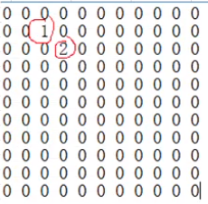

## 稀疏数组与队列

---

#### 1. 稀疏数组

|      | row  | col  | val  |
| ---- | ---- | ---- | ---- |
| 0    | 11   | 11   | 2    |
| 1    | 1    | 2    | 1    |
| 2    | 2    | 3    | 2    |

第一行记录数组大小，共有11行，11列，内含两个值。

第二行记录第一个有效数据，在行1列2，值为1。第三行同理。

11 * 11数组变为3 * 3的稀疏数组。

---

**二维数组转稀疏数组的思路**

1. 遍历原始的二维数组，得到有效数据的个数sum
2. 根据sum就可以创建稀疏数组sparseArr int [sum+1] [3]
3. 将二维数组的有效数据存入到稀疏数组中

**稀疏数组转原始的二维数组的思路**

1. 先读取稀疏数组的第一行，根据第一行的数据创建原始数组
2. 在读取稀疏数组后几行的数据，并赋给原始二维数组

