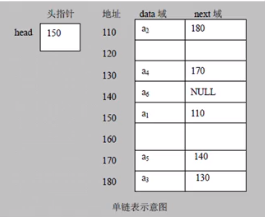

## 链表

---

1. 链表是以节点的方式来存储的。

2. 每个节点包含data域，next域（指向下一个节点）

   

   

3. 链表分为带头节点的链表和没有头节点的链表，根据实际的需求来确定。

- ```java
  class HeroNode { 
      int no; 
      String name; 
      String nickName; 
      HeroNode next;
  }
  ```

- head节点

  - 不存放具体的数据
  - 作用就是表示单链表头

- head | next -> HeroNode | next -> HeroNode | next (null)

---

#### 添加（创建）

1. 先创建一个head头节点，作用就是表示单链表的头。
2. 后面我们每添加一个节点，就直接加入到链表的最后。

需要按照编号的顺序添加

1. 首先找到新添加的节点的位置，是通过辅助变量来找的。通过遍历来找位置。
2. `新的节点.next`=`temp.next`
3. 将`temp.next = `新的节点

